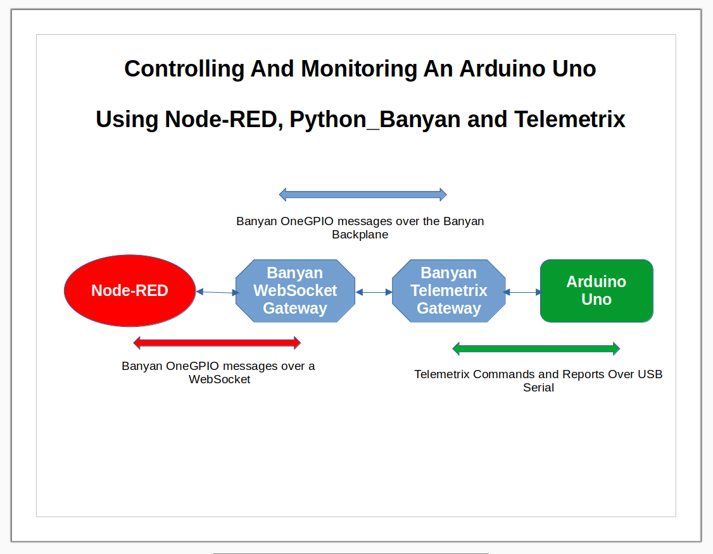

# UNDER CONSTRUCTION

# Banyan Bits

Banyan Bits is an eclectic collection of 
[Python Banyan](https://mryslab.github.io/python_banyan/) centric code and projects.
This repository will be updated on an irregular basis.

This repository currently contains:
* Samples of simple Banyan components that can act as a coding template for creating 
  new Banyan components.
    * Echo client/servers, written in both asyncio and traditional Python.
* A project that integrates Node-RED, Python Banyan, and Telemetrix. It is comprised 
  of code for the following:
    * A Node-RED dashboard that sends and receives OneGPIO messages via a WebSocket. 
    * A Python Banyan WebSocket gateway for Node-RED.
    * A Python Banyan-TelemetrixAIO gateway to control an Arduino Uno GPIO.
    * A Python Banyan component to initialize pin modes when the application starts.
  

## Prerequisites
The following needs to be installed on your system:
* python_banyan
* [telemetrix-aio]()
* Node-RED

 
 

This project was developed with [Pycharm](https://www.jetbrains.com/pycharm/) 
